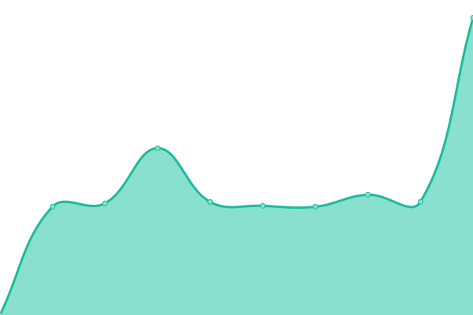

# [📈 Live Status](https://ayeja153.github.io/websites-checks): <!--live status--> **🟧 Partial outage**

This repository contains the open-source uptime monitor and status page for [ayeja153](https://ayeja153.github.io/websites-checks), powered by [Upptime](https://github.com/upptime/upptime).

With [Upptime](https://upptime.js.org), you can get your own unlimited and free uptime monitor and status page, powered entirely by a GitHub repository. We use [Issues](https://github.com/ayeja153/websites-checks/issues) as incident reports, [Actions](https://github.com/ayeja153/websites-checks/actions) as uptime monitors, and [Pages](https://ayeja153.github.io/websites-checks) for the status page.

<!--start: status pages-->
<!-- This summary is generated by Upptime (https://github.com/upptime/upptime) -->
<!-- Do not edit this manually, your changes will be overwritten -->
<!-- prettier-ignore -->
| URL | Status | History | Response Time | Uptime |
| --- | ------ | ------- | ------------- | ------ |
|  [UCI](https://www.uci.cu) | 🟩 Up | [uci.yml](https://github.com/ayeja153/websites-checks/commits/HEAD/history/uci.yml) | 

 2601ms
     
 | 

<a href="https://ayeja153.github.io/websites-checks/history/uci">100.00%</a>
    

|  [DownSite](https://down.test.cu) | 🟥 Down | [down-site.yml](https://github.com/ayeja153/websites-checks/commits/HEAD/history/down-site.yml) | 

 0ms
     
 | 

<a href="https://ayeja153.github.io/websites-checks/history/down-site">0.00%</a>
    

|  Secret | 🟩 Up | [secret.yml](https://github.com/ayeja153/websites-checks/commits/HEAD/history/secret.yml) | 

 91ms
     
 | 

<a href="https://ayeja153.github.io/websites-checks/history/secret">100.00%</a>
    

<!--end: status pages-->

[**Visit our status website →**](https://ayeja153.github.io/websites-checks)

## 📄 License

- Powered by: [Upptime](https://github.com/upptime/upptime)
- Code: [MIT](./LICENSE) © [ayeja153](https://ayeja153.github.io/websites-checks)
- Data in the `./history` directory: [Open Database License](https://opendatacommons.org/licenses/odbl/1-0/)
